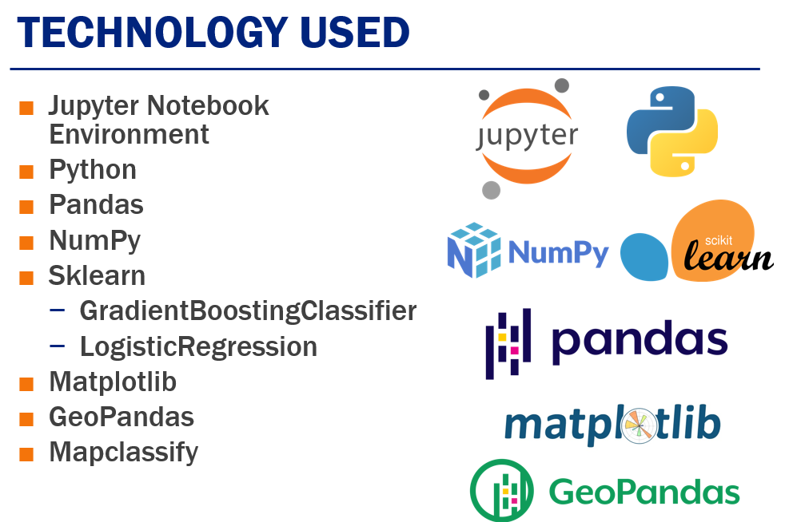
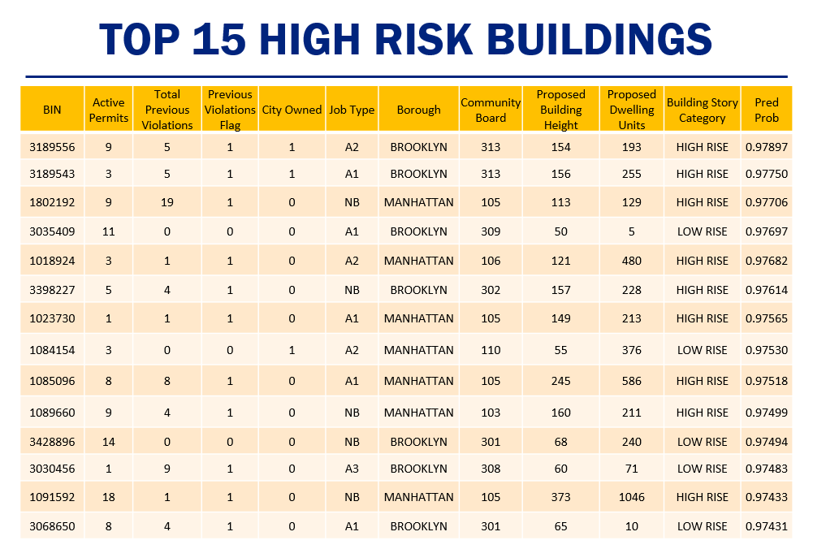
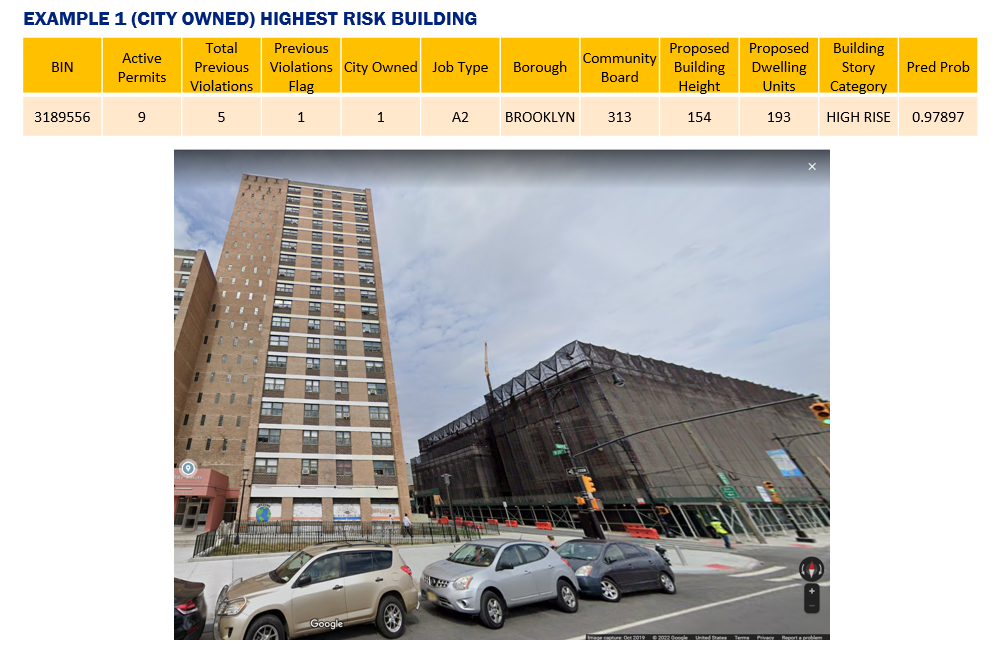
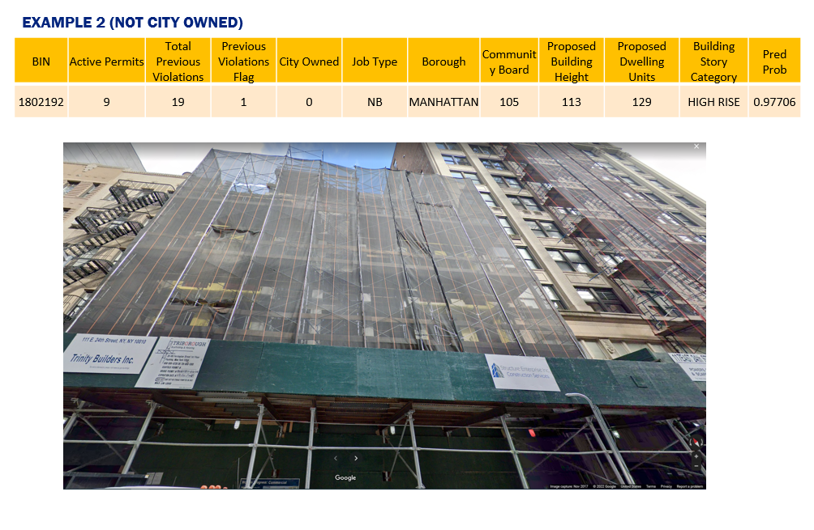
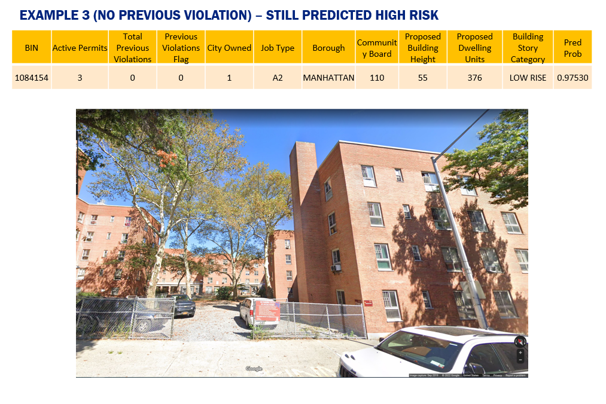
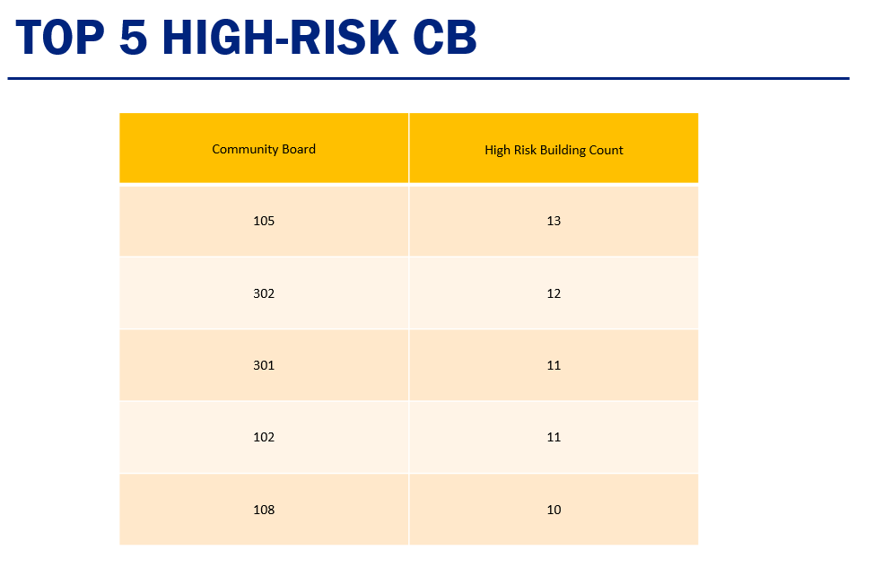
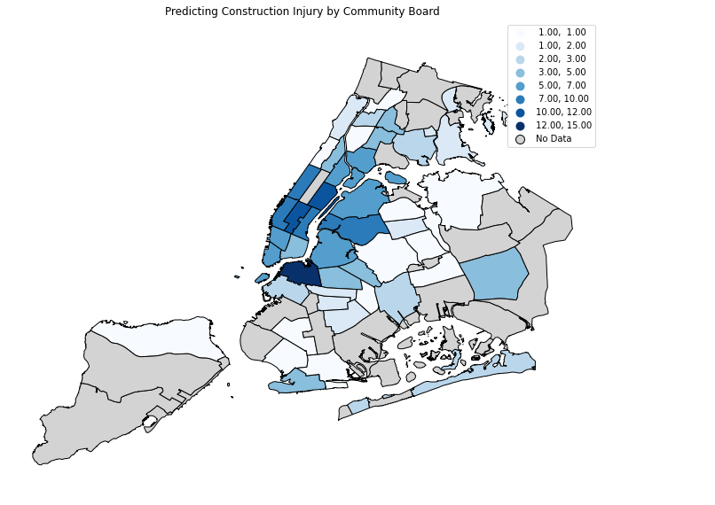

---
## **Predicting Construction Injuries with Deep Learning and ML**
---
### Problem Statement:
 - Which buildings are high-risk in terms of construction injuries?
 - Which community boards have higher construction injuries?

### Objective:
Use the results to better inform proactive enforcement actions on high-risk construction sites 

### Approach and Solution
- Collect relevant data
    - DOB Now Job Permits
    - BIS Job Permits 
    - Incidents-Accidents Data
    - DOB Violations
    - DOB Property
    - Elevator ECB Violations Issued

- Pick appropriate classification Model
    - Hyperparameter Tuning 
    - Train
    - Validate
    - Test

- To obtain optimal results, the data should be of the same type. 
- All variables were therefore converted into categories and then into dummy variables.
- The data was partitioned into training, validation and testing datasets.
- Hyper-parameter tuning was used on the training and validation datasets to optimize model performance.
- The final model was tested using the test dataset.
- Using the final model, a probability of high risk was assigned to each building

### Technologies

### Results

- Train Score: 0.8959
- Test Score: 0.8994
- Precision: 0.9192
- Recall: 0.8613
- f1: 0.8893
- AUC: 0.9753
- Accuracy: 0.8994

### Top 15 High-risk buildings

### Examples
#### (1)

#### (2)

#### (3)

### Top 5 High-Risk Community Boards

### Map

